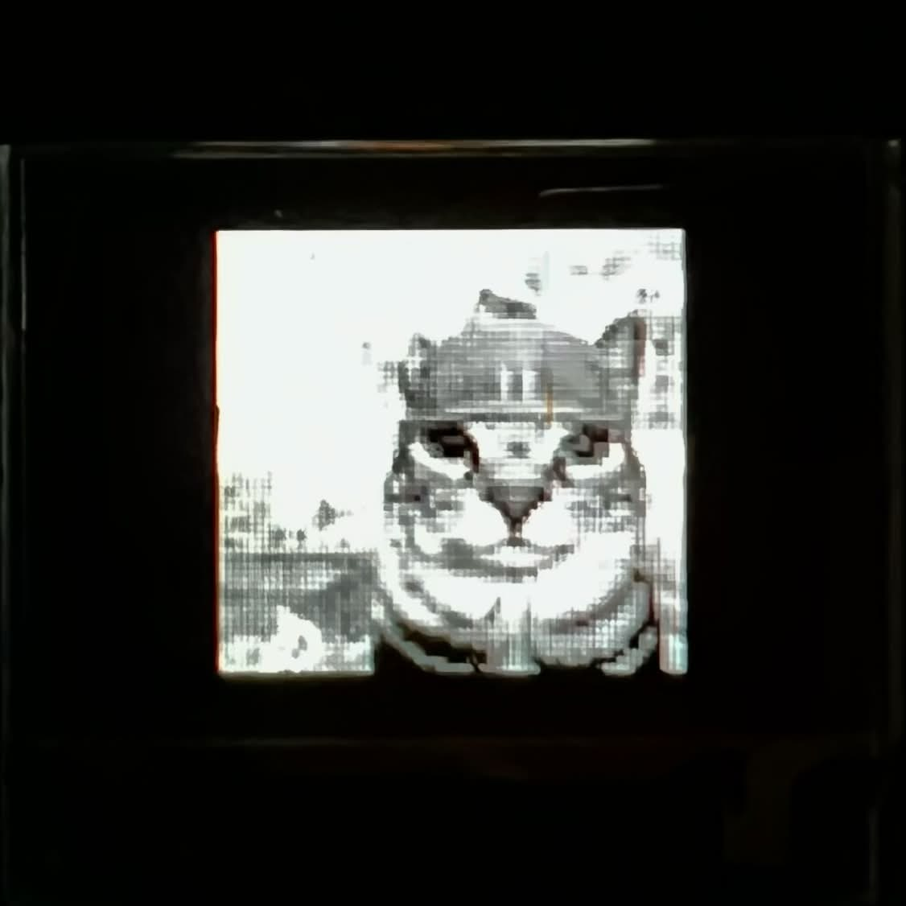

# Kernal_Filters_BASYS3

A reconfigurable spatial-convolution kernel filter, implemented in Verilog/SystemVerilog for the Digilent Basys 3 (Xilinx Artix-7) FPGA, applied to Sobel edge detection and displayed on a PMOD OLEDrgb.

<p align="center">
  <br>
  <em>Blurry due to the OLED's native 96x64 resolution and moiré/focus artifacts from photographing the physical screen — not a rendering issue.</em>
</p>

## Overview

Sobel edge detection works by convolving an image with two small kernels — one that responds to vertical edges (Gx) and one that responds to horizontal edges (Gy). The classic 3x3 Sobel kernels are:

```
        -1  0  1              -1 -2 -1
Gx  =   -2  0  2        Gy  =   0  0  0
        -1  0  1               1  2  1
```

Each output pixel is the weighted sum of a pixel neighborhood, so Gx and Gy convolution are structurally identical — the same sliding-window, multiply-accumulate operation, just with different coefficients loaded in. That means a single piece of hardware — one generic kernel filter datapath — can implement Gx, Gy, or any other NxN kernel just by swapping the coefficient set fed into it. Nothing about the pipeline (line buffers, sliding window, MAC array, accumulator) changes between filters.

The two gradient outputs are combined per-pixel into a gradient magnitude, approximated in hardware as `|Gx| + |Gy|` (avoiding a square root) to produce the final edge-detected image.

## Architecture

```
frame_store --> [pre-stage: identity/blur] --+--> [Gx]      -> gx     --+
 (BRAM,           (cascade_en selects)       +--> [Gy]      -> gy     --+--> mode mux --> frame_buffer --> PMOD OLEDrgb
  24 x 96x64                                 +--> [bypass]  -> bypass --+     (RGB565)      (BRAM)          (SPI, SSD1331)
  8-bit grayscale
  frames, frame_idx
  selects one)
```

- **`kernel_filter_core`** (`src/kernel_filter_core.sv`) is the reusable engine: a parameterized NxN convolution (line buffers, sliding window, MAC array) whose behavior is entirely defined by a runtime `coeffs` input. `sobel_pipeline` instantiates it **four times** — pre-stage, Gx, Gy, and bypass — all sharing the identical hardware, differing only in which coefficients are loaded.
- **`sobel_pipeline`** (`src/sobel_pipeline.sv`) composes those four instances plus `magnitude_combine` into the full Sobel datapath, and muxes between four display modes based on `disp_mode`:
  - `00` = bypass (the pre-stage's own output — the original image, or blurred if cascade is enabled)
  - `01` = Gx only (vertical-edge strength)
  - `10` = Gy only (horizontal-edge strength)
  - `11` = magnitude (combined Sobel edges, `|Gx| + |Gy|`)
- **Cascade mode** (`cascade_en`): the pre-stage ahead of Gx/Gy is always present in the pipeline. With cascade off it's loaded with an identity kernel (pure pass-through); with cascade on it's loaded with a blur kernel, so Gx/Gy end up operating on a blurred image — a second, different coefficient set running through the exact same reused hardware, chained ahead of the first.
- **`frame_store`** (`src/frame_store.sv`) is a BRAM holding `NUM_FRAMES` (default 24) stored 96x64 grayscale images back-to-back in one flat array, addressed by `frame_idx*NUM_PIX + raster_offset`. `frame_idx` is only latched into that base address at the start of a render pass, so changing it mid-stream never corrupts an in-flight frame.
- **`frame_nav`** (`src/frame_nav.sv`) owns BTNL/BTNR (debounced, edge-detected to one step per press, wrapping in both directions) and an autoplay timer (enabled by `SW[3]`, ticks at a fixed rate) that both drive the same `frame_idx`, giving a manual "gallery" browse and simple auto-playing "animation" through the same frame store.
- **`seg7`** (`src/seg7.sv`) drives the onboard 4-digit 7-segment display (2 active digits) to show the current `frame_idx` live.
- **`render_ctrl`** (`src/render_ctrl.sv`) owns `frame_store` and a small FSM: on trigger, it clears the frame buffer to black, then streams the selected frame through `sobel_pipeline`, writing each output pixel (converted 8-bit grayscale -> RGB565) to its address in `frame_buffer`.
- **`frame_buffer`** (`src/frame_buffer.sv`) is a dual-port BRAM decoupling the fast pixel pipeline (write side) from the much slower SPI writes to the display (read side, driven continuously by `pmod_oledrgb`).
- **`pmod_oledrgb`** (`src/pmod_oledrgb.sv`) is the SSD1331 SPI driver: runs the panel's init sequence once, sets the address window to the full screen once, then streams `frame_buffer`'s contents out over SPI forever.

Switches: `SW[1:0]` select the display mode, `SW[2]` enables cascade, `SW[3]` enables frame auto-play; changing any of `SW[2:0]` or the current frame triggers a fresh render pass. `SW[15:4]` are reserved. `BTNC` is the global reset; `BTNL`/`BTNR` manually step to the previous/next stored frame.

`LD[3:0]` are a permanent bring-up/health-check debug ladder for the OLED path, since the SPI protocol and pin mapping to the physical panel can't be verified in simulation:

| LED | Meaning | If it never lights |
|---|---|---|
| LD0 | Heartbeat — blinks off the system clock, independent of everything else | Bitstream isn't running at all |
| LD1 | `oled_resn` — goes high almost immediately after reset releases, dips low briefly (~5us) for the actual reset pulse around the 20ms mark, then stays high | OLED driver's power-up sequencing or the `oled_resn` pin mapping |
| LD2 | Sticky: latches once the full power-on sequence (~145ms: PMODEN settle, reset pulse, command-lock/init bytes, VCCEN settle, display ON, post-ON wait) finishes and pixel streaming starts | SPI/init FSM is stuck partway through power-on — check the SPI clock mode/idle polarity and the command-lock unlock byte first |
| LD3 | Sticky: latches once a full render pass into the frame buffer completes | Image pipeline itself (independent of the OLED path) |

LD2 in particular takes a little over 145ms to light after reset (the OLED's documented power-on sequence has ~145ms of mandatory settling time built in), so give it a moment before concluding it's stuck.

## Hardware

- **Board**: Digilent Basys 3 (Xilinx Artix-7 XC7A35T)
- **Display**: PMOD OLEDrgb — 96x64 RGB OLED, 16-bit color (RGB565), SSD1331-based, connected via PMOD JB (SPI)
- **Inputs**: Basys 3 slide switches (filter mode / cascade / autoplay), BTNC (reset), BTNL/BTNR (manual frame step)
- **Outputs**: LD0-LD3 (bring-up debug LEDs, see table above), onboard 7-segment display (current frame index)

## Toolchain

- **HDL**: Verilog / SystemVerilog
- **Synthesis & Implementation**: Xilinx Vivado (WebPACK / free license)
- **Simulation**: Icarus Verilog (used during development — see caveats below) or Vivado Simulator (XSim)

## Repository Structure

```
Kernal_Filters_BASYS3/
├── src/                      # Synthesizable RTL
│   ├── kernel_coeffs_pkg.sv  #   Coefficient ROM (Sobel Gx/Gy, identity, blur)
│   ├── kernel_filter_core.sv #   Generic reconfigurable NxN convolution engine
│   ├── magnitude_combine.sv  #   |Gx| + |Gy|, saturated
│   ├── sobel_pipeline.sv     #   Composes the core into the full Sobel datapath + mode mux
│   ├── frame_store.sv        #   Multi-frame source image BRAM, streams in raster order
│   ├── frame_buffer.sv       #   Dual-port output frame BRAM
│   ├── render_ctrl.sv        #   Clear + stream FSM, drives frame_store -> sobel_pipeline -> frame_buffer
│   ├── pmod_oledrgb.sv       #   SSD1331 SPI driver
│   ├── frame_nav.sv          #   BTNL/BTNR step + autoplay -> frame_idx
│   ├── seg7.sv               #   4-digit 7-segment display driver (frame index readout)
│   ├── debounce.sv           #   Switch/button debouncer
│   └── top.sv                #   Top-level, switch handling, module wiring
├── sim/                      # Testbenches + generated .mem test images
├── constraints/basys3.xdc    # Pin mapping, clock constraint
├── vivado/build.tcl          # Recreates the Vivado project from scratch
├── photos/                   # Pictures of the board/display running
└── tools/
    ├── gen_test_image.py     # Synthetic placeholder test image generator
    ├── img_common.py         # Shared grayscale/resize/preview helpers
    ├── img_to_mem.py         # Downsizes a real photo to 96x64 for frame_store
    └── video_to_mem.py       # Extracts evenly-spaced frames from a video into one combined .mem
```

## Building in Vivado

```
vivado -mode batch -source vivado/build.tcl
```

This creates `vivado/project/kernel_filters_basys3.xpr` (gitignored) with all sources, the constraints file, and `sim/frame_store.mem` added as a memory initialization file. Open it in the GUI, or continue in batch mode, to run synthesis/implementation and generate a bitstream.

## Loading images / a video

`frame_store` holds `NUM_FRAMES` (default 24) stored frames, loaded from `sim/frame_store.mem` at synthesis time.

**A single photo**, repeated or swapped in for the default synthetic placeholder:

```
pip install pillow
python tools/img_to_mem.py your_photo.jpg --out sim/frame_store.mem --preview
```

This grayscales, center-crops, and downsizes the image to 96x64, writes it as a `$readmemh`-compatible `.mem` file, and (with `--preview`) also saves a 16x-upscaled PNG so you can see exactly what will be loaded before resynthesizing. `--fit contain` letterboxes instead of cropping, and `--fit stretch` ignores aspect ratio entirely. Note this only writes **one** frame — pad or repeat it, or use `video_to_mem.py` below, to fill all `NUM_FRAMES`.

**A video**, sampled into a full set of frames for the gallery/autoplay feature:

```
pip install pillow
winget install ffmpeg   # or your platform's equivalent; needs ffmpeg/ffprobe on PATH
python tools/video_to_mem.py your_clip.mp4 --out sim/frame_store.mem --num-frames 24 --preview
```

This extracts `--num-frames` evenly-spaced frames from the clip, runs each through the same grayscale/resize pipeline as `img_to_mem.py`, and concatenates them into one combined `.mem` file matching `frame_store`'s flat addressing. **`--num-frames` must equal `NUM_FRAMES` in `frame_store.sv`/`render_ctrl.sv`/`top.sv`** (both default to 24) — there's no build-time link between the tooling and the RTL, so a mismatch will silently raster-wrap into the wrong frame.

## Simulation

Every module below `top.sv` has been simulated (with Icarus Verilog) and checked against a from-scratch behavioral reference, including full pixel-count and coverage checks:

- `sim/tb_kernel_filter_core.sv` — the generic core against identity/Gx/Gy/blur, verifying the convolution math and output timing/coordinates.
- `sim/tb_cascade.sv` — two `kernel_filter_core` instances chained directly, verifying the core composes correctly when a downstream stage's input coordinates don't start at (0,0).
- `sim/tb_sobel_pipeline.sv` — the full pipeline across all 4 display modes x 2 cascade settings, at both a small test size and the real 96x64 resolution (44,160 pixels checked with zero mismatches).
- `sim/tb_pmod_oledrgb.sv` — SPI byte-shifter mechanics and FSM sequencing (init -> window -> streaming).
- `sim/tb_frame_store.sv` — `frame_idx*NUM_PIX` addressing against a pure-ramp reference fixture, full pixel-coverage per frame, and confirms a `frame_idx` change mid-stream doesn't corrupt an in-flight render (only latched at `frame_start`).
- `sim/tb_frame_nav.sv` — BTNL/BTNR debounce + edge-detect (exactly one step per press, not continuous while held), wraparound in both directions, autoplay ticking at the configured period only when enabled, and a manual step during autoplay restarting the timer correctly.
- `sim/tb_seg7.sv` — active-low segment decode against an independent reference table, `an[3:2]` always off, exactly one of `an[1:0]` active at a time, and the digit-swap interval matching `REFRESH_CYCLES`.

**Known simulator limitation**: Icarus Verilog (as of the version used here) can't elaborate a `parameter string` that's forwarded by reference through more than one level of module hierarchy (`top` -> `render_ctrl` -> `frame_store`, both using `.INIT_FILE(INIT_FILE)`). This is a standard, portable SystemVerilog pattern that Vivado's synthesizer and XSim handle correctly — it only affects simulating `top.sv`/`render_ctrl.sv` standalone in Icarus. `sim/tb_top_smoke.sv` works around it by instantiating `render_ctrl` directly with a literal `INIT_FILE` string, which verifies everything except `top.sv`'s own (simple) switch-debounce/edge-detect glue logic.

**Another Icarus-specific gotcha found while writing these**: driving a DUT's inputs with *blocking* assignment (`=`) from inside a `task` right before `@(posedge clk)` triggered a scheduling bug in this Icarus build where the DUT's registered outputs never updated at all, even though the input value itself was confirmed correct at the sampling edge. Switching to non-blocking assignment (`<=`) for task-driven testbench signals — already this codebase's established convention (see `tb_sobel_pipeline.sv`'s `stream_frame`/`run_case` tasks) — fixed it. Worth knowing if a new testbench task mysteriously reads back stale/never-updated DUT state.

## Status

Working end-to-end on real hardware: image source -> Sobel pipeline -> frame buffer -> OLED driver, displayed live on the PMOD OLEDrgb over PMOD JB. See `photos/` for the board running.

Bring-up took two rounds of debugging, since the SPI protocol/pin mapping couldn't be verified in simulation. First, cross-checking against Digilent's reference manual fixed several concrete bugs (wrong SPI mode, a missing command-lock byte, backwards VCCEN power sequencing, an off-by-one pin mapping, and missing power-on settling time). The display was still dark after that fix, which turned out to be a separate bug: `oled_dc` in `pmod_oledrgb.sv` was driven by two different `always_ff` blocks — simulators quietly resolve that by event order, but Vivado's synthesizer collapsed it to a stuck-low constant driver, so every streamed byte was read by the SSD1331 as a command instead of pixel data. Removing the redundant driver fixed it.

**In progress**: post-place-and-route utilization sat at only ~12% BRAM (6/50 RAMB36 tiles) with the single-image setup, so `frame_store`/`frame_nav`/`seg7` were added to put that headroom to use — a 24-frame store browsable by BTNL/BTNR (gallery) or auto-played via `SW[3]` (simple animation), with the current frame index shown on the 7-segment display. RTL and simulation are complete and passing; not yet confirmed on hardware, pending real video content (`tools/video_to_mem.py`) and a resynthesis.

## Stretch Goals / Next Steps

- **VGA output**: add a second display path alongside the OLED driving the Basys 3's onboard VGA port, so the same Sobel pipeline can render to an external monitor. This is also where a genuine resolution increase becomes worthwhile — the PMOD OLEDrgb is a fixed 96x64 panel, so `frame_store`/`frame_buffer` being sized bigger wouldn't show up on it regardless; a VGA monitor has no such ceiling.
- **Double-buffering**: `render_ctrl` currently writes into the same `frame_buffer` that `pmod_oledrgb` reads from continuously, so a render pass is visible mid-update (acceptable tearing for a demo, called out in `render_ctrl.sv`'s header comment). A second buffer swapped atomically per frame would remove that.
